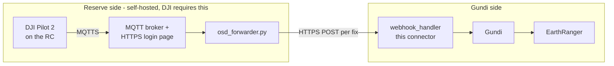

# gundi-integration-dji-cloudapi

**Live DJI Enterprise drone telemetry → [Gundi](https://www.earthranger.com/) → EarthRanger** — no Dock, no fleet-management subscription.

Any DJI Enterprise aircraft flown with **DJI Pilot 2** (Mavic 3E/3T, Matrice 30/300/350, …) can stream its position to a self-hosted platform over MQTT using DJI's [Cloud API "Pilot-to-Cloud"](https://developer.dji.com/doc/cloud-api-tutorial/en/) protocol. This integration turns that stream into Gundi observations, so a drone appears in EarthRanger as a live tracked subject — alongside rangers, vehicles, and wildlife.

Built from PADAS's [gundi-integration-action-runner](https://github.com/PADAS/gundi-integration-action-runner) template (framework docs preserved at [docs/ACTION_RUNNER.md](docs/ACTION_RUNNER.md)). A reference deployment runs in production at a rhino sanctuary in South Africa.

## Architecture



- **Reserve side** ([reserve-side/](reserve-side/)): DJI Pilot 2 will only connect to a platform the *operator* hosts — an HTTPS login page plus an MQTT broker with a valid TLS certificate. The forwarder subscribes to the aircraft's OSD topic, answers DJI's `update_topo` handshake, filters aircraft telemetry from RC telemetry, carries DJI's incremental field updates forward, and emits one clean, normalized fix per position update. Runs on a free-tier cloud VM (~$0/month) or any always-on box.
- **Gundi side** (this repo): a standard action-runner **webhook integration**. Each incoming fix is validated against a fixed Pydantic schema and transformed into a Gundi observation (`type: tracking-device`, `subject_type: drone` by default). Sources and subjects are auto-provisioned downstream.

The split is deliberate: the MQTT platform is DJI-mandated reserve infrastructure; the connector stays thin and stateless.

## Webhook payload contract

One JSON object per fix. Identity, position, and time are required; telemetry is optional.

| Field | Type | Req | Description |
|---|---|---|---|
| `device_sn` | string | ✔ | Aircraft serial number (becomes the Gundi source id) |
| `recorded_at` | ISO 8601 datetime | ✔ | Fix timestamp (UTC) |
| `latitude` | float | ✔ | −90…90 |
| `longitude` | float | ✔ | −180…180 |
| `model_name` | string | | e.g. `DJI Mavic 3T` |
| `height` | float | | Height above takeoff point, m |
| `elevation` | float | | Elevation ASL, m (mapped to `location.alt`) |
| `gps` | int | | GPS satellite count |
| `horizontal_speed` | float | | m/s |
| `vertical_speed` | float | | m/s |
| `attitude_head` | float | | Heading, degrees |
| `mode_code` | int | | DJI flight mode code |
| `battery` | int | | Battery, percent |

```bash
curl -X POST "https://hooks.gundiservice.org/webhooks?integration_type=dji_cloudapi&apikey=$APIKEY" \
  -H "Content-Type: application/json" \
  -d '{"device_sn":"1581F5XXXXXXXXXXXXX","recorded_at":"2026-07-12T10:10:48Z",
       "latitude":-21.4012,"longitude":28.3403,"height":120.5,"gps":17,"battery":93}'
```

Connector configuration (set per integration in the Gundi portal): `subject_type` (default `drone`) and `source_name_prefix` (e.g. `DJI ` names the subject `DJI 00A1B2` from the serial's last 6 characters).

## Status

- ✅ Webhook handler, payload schema, and tests (fixtures derived from real Mavic 3T flight captures)
- ✅ Reserve-side reference stack, field-proven: platform deploy (nginx + Mosquitto + Let's Encrypt via docker-compose), forwarder, systemd units
- ⏳ Pending registration/deployment as an official Gundi integration type (`dji_cloudapi`). Until then, the forwarder can push the same fixes to Gundi's self-service [Sensors API v2](https://support.earthranger.com/developer_docs/gundi-api) (`GUNDI_MODE=sensors`, the default) using any push connection's API key — same data, same result in EarthRanger.

## Reserve-side setup (summary)

Full stack in [reserve-side/](reserve-side/). Prerequisites:

1. **DJI Pilot 2** on the remote controller (enterprise controllers only; consumer DJI Fly has no Cloud Service menu).
2. A **DJI Developer "Cloud API" app** — App ID, App Key, and License from [developer.dji.com](https://developer.dji.com) (free; approval takes a few days).
3. A host with a **real domain and valid TLS certificate** — Pilot 2 rejects self-signed certs. The provided `setup.sh` stands up everything on a free-tier VM with a free DuckDNS subdomain and Let's Encrypt: HTTPS login page (443), MQTTS broker (8883), auto-renewing certs.
4. Run `osd_forwarder.py` (systemd unit provided) with your Gundi API key.
5. In Pilot 2: **Cloud Service → Open Platforms →** your platform URL → Login → fly. Telemetry persists across app views (the login page registers as a persistent DJI Cloud Service via `platformSetWorkspaceId`).

Notes learned in the field: aircraft OSD arrives at ~0.5 Hz with incremental fields (the forwarder carries state forward); the RC publishes its own OSD on the same topic pattern (filtered by the absence of flight fields); the forwarder must answer `update_topo` or the aircraft never starts publishing.

## Development

```bash
pip install -r requirements.txt
pytest app/webhooks/tests/ -v
```

Handler: [app/webhooks/handlers.py](app/webhooks/handlers.py) · Schema: [app/webhooks/configurations.py](app/webhooks/configurations.py) · Framework: [docs/ACTION_RUNNER.md](docs/ACTION_RUNNER.md)

## License

Apache-2.0, same as the upstream template.
